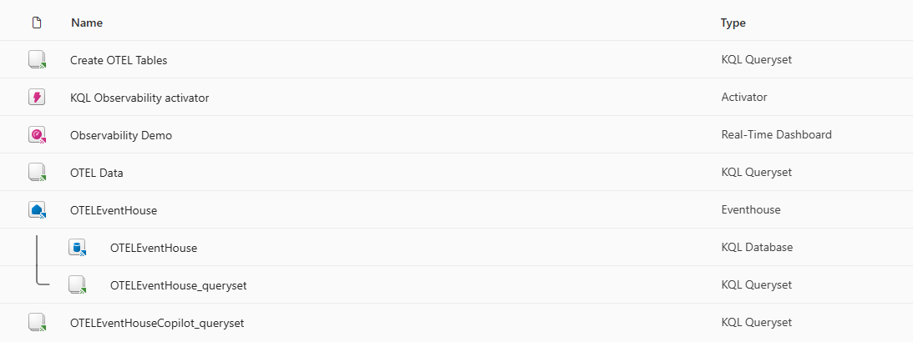
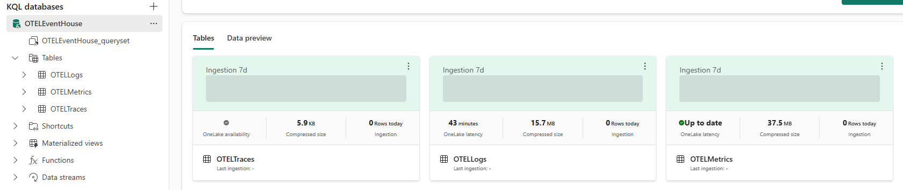
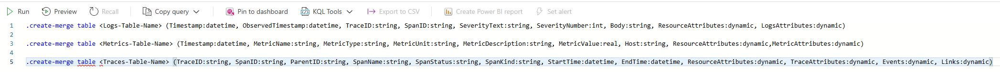

# Microsoft Fabric Observability Sample

## Content

- Deploy Microsoft Fabric for OTEL Observability use
- Deploy Azure Event Hub for Azure Diagnostic exports
- Deploy OTEL contrib distribution as Azure Diagnostic receiver
- Deploy telemetry sample Azure services

## Deploy Microsoft Fabric for OTEL Observability

Follow [Microsoft Learn article for configuring OTEL collection for Azure Data Explorer (or Microsoft Fabric Real-Time Intelligence)](https://learn.microsoft.com/azure/data-explorer/open-telemetry-connector). 

## References
- https://learn.microsoft.com/en-us/azure/data-explorer/open-telemetry-connector?context=%2Ffabric%2Fcontext%2Fcontext-rti&pivots=fabric&tabs=command-line
- https://github.com/open-telemetry/opentelemetry-dotnet/tree/main/docs
