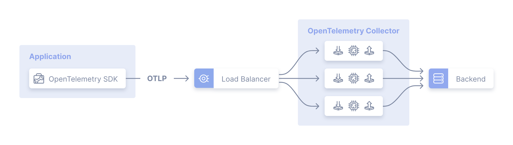
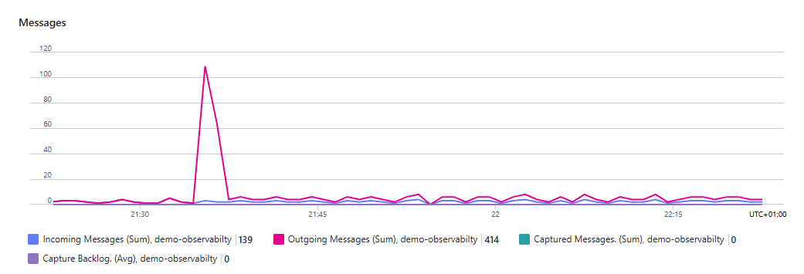
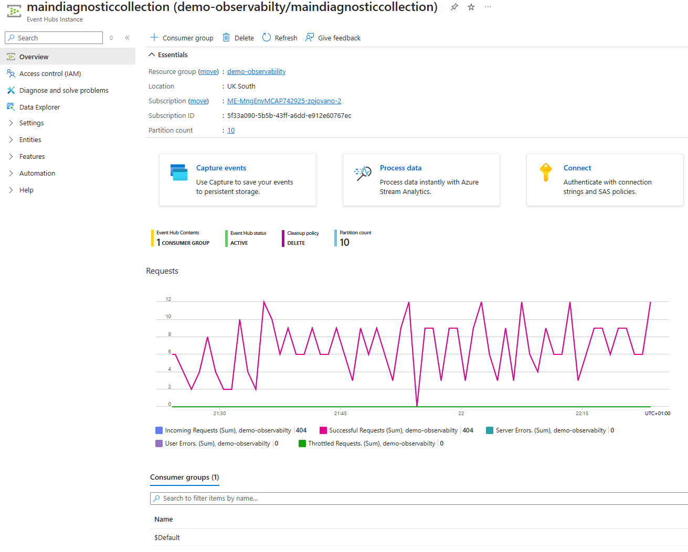
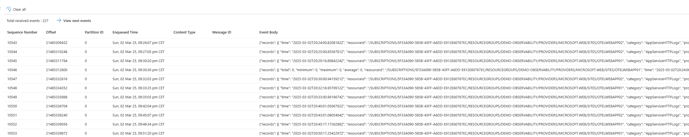
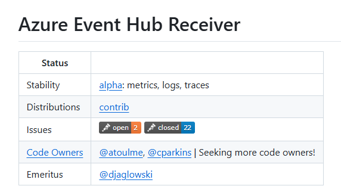
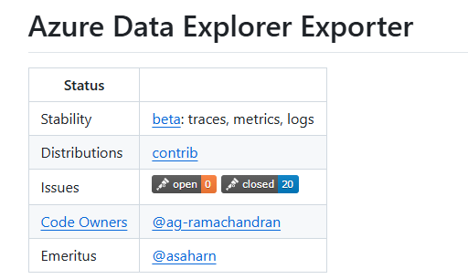
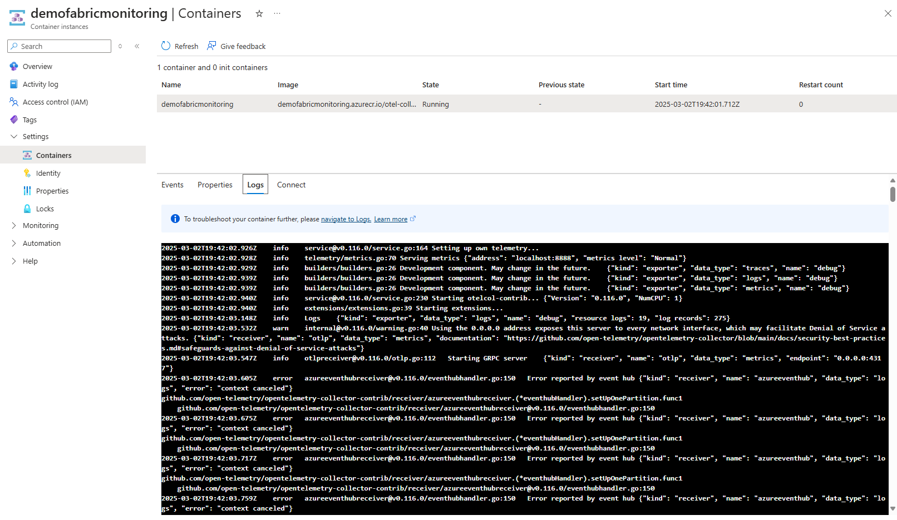

# Microsoft Fabric Observability Sample

## Content

- Deploy Microsoft Fabric for OTEL Observability use
- Deploy Azure Event Hub for Azure Diagnostic exports
- Deploy OTEL contrib distribution as Azure Diagnostic receiver
- Deploy telemetry sample Azure services

## Solution

We will use [OTEL Gateway Deployment pattern](https://opentelemetry.io/docs/collector/deployment/gateway/) with containerized version of OTEL Collector.


Telemetry collection flow: Azure Resource => Azure Event Hub => Azure Container instance (with OTELContrib Collector) => Microsoft Fabric Real-Time Intelligence (KQL Database)

## Deploy Microsoft Fabric for OTEL Observability

Follow [Microsoft Learn article for configuring OTEL collection for Azure Data Explorer (or Microsoft Fabric Real-Time Intelligence)](https://learn.microsoft.com/azure/data-explorer/open-telemetry-connector). 


## Deploy Azure Event Hub








Sample Even Hubs diagnostic record from Azure App Service

```json
{
    "records": [
        {
            "time": "2025-03-02T20:24:00.8208182Z",
            "resourceId": "/SUBSCRIPTIONS/5F33A090-5B5B-43FF-A6DD-E912E60767EC/RESOURCEGROUPS/DEMO-OBSERVABILITY/PROVIDERS/MICROSOFT.WEB/SITES/OTELWEBAPP02",
            "category": "AppServiceHTTPLogs",
            "properties": {
                "CsMethod": "GET",
                "CsUriStem": "/",
                "SPort": "443",
                "CIp": "52.158.28.64",
                "UserAgent": "Mozilla/5.0+(compatible;+MSIE+9.0;+Windows+NT+6.1;+Trident/5.0;+AppInsights)",
                "CsHost": "otelwebapp02-b4ejc3ckb9ecd9fd.uksouth-01.azurewebsites.net",
                "ScStatus": 200,
                "ScSubStatus": "0",
                "ScWin32Status": "0",
                "ScBytes": 2140,
                "CsBytes": 1386,
                "TimeTaken": 17,
                "Result": "Success",
                "Cookie": "-",
                "CsUriQuery": "X-ARR-LOG-ID=aa4d225f-5f9d-4ad3-9ce9-3a85565c0b49",
                "CsUsername": "-",
                "Referer": "-",
                "ComputerName": "WEBWK000003"
            }
        }
    ]
}
```

## Deploy OTEL contrib distribution as Azure Diagnostic receiver

[OpenTelemetry Collector Contrib](https://github.com/open-telemetry/opentelemetry-collector-contrib) distribution will be configured and deployed as a Azure Container Instance as a OTEL Collector Gateway. 
Docker image "otel/opentelemetry-collector-contrib" 

We will use "Azure Event Hub Receiver" which is part of the "OpenTelemetry Collector Contrib" distribution. 


and Azure Data Explorer Exporter



You can search for available extensions in the [OTEL registry](https://opentelemetry.io/ecosystem/registry/).

Following is the full OTEL config.yaml content:

```yml
extensions:

receivers:
  otlp:
    protocols:
      grpc:
        endpoint: 0.0.0.0:4317

  azureeventhub:
    connection: Endpoint=sb://namespace.servicebus.windows.net/;SharedAccessKeyName=RootManageSharedAccessKey;SharedAccessKey=<key>;EntityPath=maindiagnosticcollection
    partition: ""
    group: $Default
    offset: ""
    format: "azure"


processors:
  batch:

exporters:
  debug:
    verbosity: basic
  azuredataexplorer:
    cluster_uri: "https://trd-sxwndfr8sm0vy6844c.z5.kusto.fabric.microsoft.com"
    application_id: "c84761b4-8a31-4cd9-baf9-bd6752190365"
    application_key: "<key>"
    tenant_id: "539d8bb1-bbd5-4f9d-836d-223c3e6d1e43"
    db_name: "OTELEventHouse"
    metrics_table_name: "OTELMetrics"
    logs_table_name: "OTELLogs"
    traces_table_name: "OTELTraces"
    ingestion_type : "managed"

service:

  pipelines:

    traces:
      receivers: [otlp]
      processors: [batch]
      exporters: [debug,azuredataexplorer]

    metrics:
      receivers: [otlp,azureeventhub]
      processors: [batch]
      exporters: [debug,azuredataexplorer]

    logs:
      receivers: [otlp,azureeventhub]
      processors: [batch]
      exporters: [debug,azuredataexplorer]
```

Deployed Azure Container with OTEL Collector



## References
- https://learn.microsoft.com/en-us/azure/data-explorer/open-telemetry-connector?context=%2Ffabric%2Fcontext%2Fcontext-rti&pivots=fabric&tabs=command-line
- https://github.com/open-telemetry/opentelemetry-dotnet/tree/main/docs
